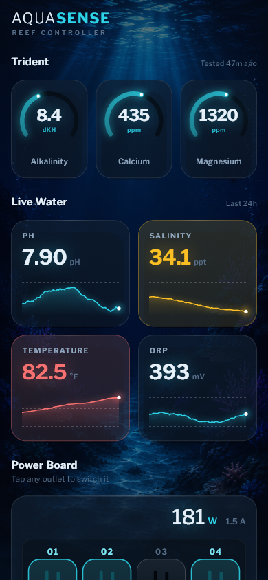
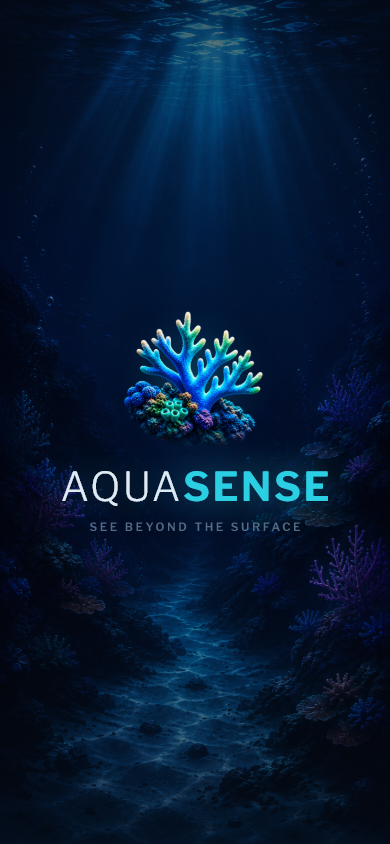

# AquaSense

A front-end reef controller dashboard, in the spirit of a Neptune Apex — water
chemistry readouts plus a digital twin of an eight-outlet Energy Bar.

Front-end only. All data comes from a mock, but it comes through the same
interface real hardware would.

| Dashboard | Splash |
|---|---|
|  |  |

## Background

Written while researching the product, before any code:

- [Product understanding](docs/Product_Understanding.md) — what the system is for
  and what the dashboard has to communicate
- [Neptune Apex research](docs/Apex_Research.md) — how the controller, Energy Bar,
  probes and Trident fit together, and why readings from different hardware cannot
  be treated as one generic sensor feed

## Running it

```bash
flutter pub get
flutter run
```

Mobile-first; Android and iOS.

## What's in it

**Parameter readouts, split by how the data is actually produced.**

- **Trident** — Alkalinity, Calcium, Magnesium. A titration unit runs these on a
  schedule, so they are discrete results hours apart. Shown as ring gauges, with
  how stale the last test is in the section header.
- **Live Water** — pH, Salinity, Temperature, ORP. Continuously sampled probes,
  so a 24-hour trend is honest here. Each trace carries dashed rules at its
  target limits, so a reading can be judged without knowing reef chemistry.

Drawing a continuous line through titration results would assert data the
controller does not have, so Trident deliberately has no chart. There is a test
asserting that probes carry history and Trident parameters do not.

**The power board.** Eight outlets in the chassis's real 2×4 arrangement, with
NEMA 5-15R slot geometry, live draw beneath each outlet, and a toggle. The whole
tile is the tap target, not just the switch.

Two parameters are seeded out of band — salinity drifting low, temperature
critically high. A dashboard where everything is always green never demonstrates
the thing a controller exists for.

## Where things live

```
lib/
  main.dart
  app.dart                     composition root — the only place the mock is named
  theme.dart                   colours, spacing, motion, fonts, breakpoints
  dashboard_controller.dart    ChangeNotifier: load, toggle, grouping
  models/
    energy_bar.dart            Outlet + EnergyBar
    water_parameter.dart       reading, bands, status, status colour
  services/
    controller_repository.dart interface + mock implementation
    feedback_player.dart       tap sound and haptics
  screens/
    splash_screen.dart         also the loading gate
    dashboard_screen.dart
  widgets/                     cards, board, sockets, painters, motion
```

## Two decisions worth knowing

**Outlet positions are data, not layout.** Each `Outlet` carries a `row` and
`column`; the board renders whatever grid `EnergyBar.rows`/`columns` describe.
Matching a different bar is a change to the data source, not a layout rewrite.
The arrangement is identical at every screen width for the same reason — an
outlet that moves when the screen narrows cannot be matched against the wall.
Below 300pt of usable width the board scrolls sideways rather than rearranging.

**The UI never sees the mock.** It depends on `ControllerRepository`. Putting real
hardware or a cloud API behind the dashboard means writing a second
implementation and changing one line in `app.dart` — no screen, widget, model or
controller has to be touched. Outlet toggles already update optimistically and
reconcile against what the hardware reports, because a real relay can refuse.

## Responsiveness

Verified by rendering, not by assumption — `test/preview_test.dart` writes PNGs
at each width into `test/goldens/`:

```bash
flutter test --update-goldens test/preview_test.dart
```

| Width | |
|---|---|
| 360pt | narrowest designed width — full board, nothing truncated |
| 390pt / 430pt | standard and large phones |
| 834pt | tablet — correct, though laid out as a wide phone rather than redesigned |
| 320pt | iPhone SE 1st gen. Degrades gracefully: the board scrolls, one label ellipsises |

## Tests

```bash
flutter test test/widget_test.dart
```

Covers the load path, the optimistic toggle and its reconciliation, the physical
grid mapping, the status bands, and the Trident/probe split.

## Not built

Backend, persistence, authentication, scheduling, and history beyond the 24-hour
window. Fonts are bundled rather than fetched at runtime so the app never needs
a network round trip to render its own labels.
